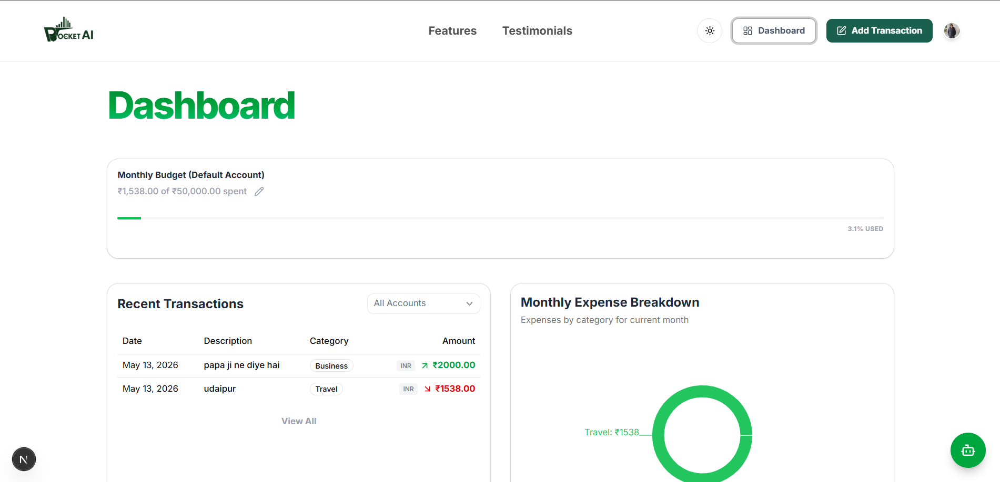

# 💰 Pocket AI — Full Stack AI Finance Platform

> 🚀 A smart, AI-powered personal finance manager built with **Next.js 16**, **Supabase**, **Prisma**, **Clerk**, **Inngest**, **ArcJet**, and **Shadcn UI**

---

## 📸 Preview




---

## ✨ Features

- 🔐 **Authentication** — Secure sign-in/sign-up via [Clerk](https://clerk.com)
- 🤖 **AI Insights** — Smart financial summaries powered by Google Gemini AI
- 📊 **Dashboard** — Visual analytics and spending charts with Recharts
- 💳 **Transaction Management** — Add, categorize, and track transactions
- 📄 **PDF Export** — Download transaction reports via React PDF Renderer
- 🔔 **Background Jobs** — Automated tasks and notifications via [Inngest](https://inngest.com)
- 🛡️ **Bot Protection** — Security and rate-limiting with [ArcJet](https://arcjet.com)
- 📧 **Email Notifications** — Beautiful transactional emails via [Resend](https://resend.com) + React Email
- 🌙 **Dark Mode** — Full light/dark theme support with `next-themes`

---

## 🛠️ Tech Stack

| Layer | Technology |
|---|---|
| ⚛️ Frontend | Next.js 16 (App Router) + React 19 |
| 🎨 UI | Shadcn UI + Tailwind CSS v4 + Base UI |
| 🔐 Auth | Clerk v7 |
| 🗄️ Database | Supabase (PostgreSQL) + Prisma v7 ORM |
| 🤖 AI | Google Gemini API |
| ⚡ Background Jobs | Inngest v4 |
| 🛡️ Security | ArcJet |
| 📧 Email | Resend + React Email |
| 📄 PDF | React PDF Renderer |
| 📦 Validation | Zod v4 + React Hook Form |

---

## 🚀 Getting Started

### 1️⃣ Install dependencies

```bash
npm install
```

### 2️⃣ Set up environment variables

Create a `.env` file in the root directory:

```env
# 🗄️ Database (Supabase)
DATABASE_URL=
DIRECT_URL=

# 🔐 Clerk Authentication
NEXT_PUBLIC_CLERK_PUBLISHABLE_KEY=
CLERK_SECRET_KEY=
NEXT_PUBLIC_CLERK_SIGN_IN_URL=/sign-in
NEXT_PUBLIC_CLERK_SIGN_UP_URL=/sign-up
NEXT_PUBLIC_CLERK_AFTER_SIGN_IN_URL=/dashboard
NEXT_PUBLIC_CLERK_AFTER_SIGN_UP_URL=/onboarding

# 🤖 AI Keys
GEMINI_API_KEY=

# 📧 Email
RESEND_API_KEY=

# 🛡️ Security
ARCJET_KEY=

# ⚡ Inngest (for local development)
INNGEST_EVENT_KEY=
INNGEST_SIGNING_KEY=

# 🌐 Supabase (optional)
NEXT_PUBLIC_SUPABASE_URL=
NEXT_PUBLIC_SUPABASE_ANON_KEY=
```

### 3️⃣ Run database migrations

```bash
npx prisma generate
npx prisma db push
```

### 4️⃣ Start the development server

```bash
npm run dev
```


---

## 📁 Project Structure

```
📦 pai
├── 📂 src/
│   ├── 📂 app/               # Next.js App Router pages & layouts
│   │   ├── 📂 (auth)/        # Sign-in / Sign-up pages
│   │   ├── 📂 dashboard/     # Main dashboard
│   │   ├── 📂 account/       # Account management
│   │   └── 📂 transaction/   # Transaction pages
│   ├── 📂 components/        # Reusable UI components
│   │   └── 📂 ui/            # Shadcn UI components
│   ├── 📂 lib/               # Utility functions & helpers
│   └── 📂 hooks/             # Custom React hooks
├── 📂 prisma/                # Prisma schema & migrations
├── 📂 emails/                # React Email templates
├── 📄 prisma.config.ts       # Prisma configuration
└── 📄 next.config.mjs        # Next.js configuration
```

---

## 📜 Available Scripts

| Script | Description |
|---|---|
| `npm run dev` | 🔥 Start development server |
| `npm run build` | 🏗️ Build for production |
| `npm run start` | ▶️ Start production server |
| `npm run lint` | 🔍 Run ESLint |

---

## 🔒 Security

This project uses **ArcJet** for:
- 🛡️ Shield protection against common attacks
- 🤖 Bot detection (blocks malicious bots, allows search engines)
- ⚡ Rate limiting per user


💡 Built with ❤️ by Manshi Kumawat